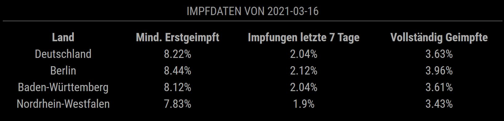

# MMM-Covid19-Vaccination
A [MagicMirror²](https://magicmirror.builders) module for Covid19 Vaccination Data for Germany



## Dependencies
This module depends on the following source: "Berliner Borgenpost"<br>
https://interaktiv.morgenpost.de/data/corona/rki-vaccinations.json
 <br>
The API can be used without any registration

## Installation

Go to your MAcigMirror's module folder:
cd ~/MagicMirror/modules

Clone this repository:
````
git clone https://github.com/fhinder/MMM-Covid19-Vaccination.git
````
Add the module to the modules list in  your config file:

````javascript
{
	module: "MMM-Covid19-Vaccination",
	position: "top_right",
	config:{
		reloadInterval: 60*60*1000,
		tableClass: "small",
    percentage: true,
		states: [		
			'Deutschland',
			'Berlin',
			'Baden-Württemberg',
      'Nordrhein-Westfalen'
		]
	}
},
````
## Configuration

|option         | description|
|---------------|------------|
|reloadInterval | Reload Interval in ms <br> <b>Possible values</b>: <code>number</code> <br> <b>Default value</b>: 3600000 |
|tableClass	| Table configuration <br> <b>Default value</b>: "small" |
|percentage| Show vaccination numbers in percentag from type boolean <br> <b> Defaulg value </b>: true |
|states	| Array of states in Germany to be displayed. If the array is empty, all states will be shown.  <br> <b>Possible values</b>: <code>array of string</code> <br> <b>Default value</b>: ["Deutschland", "Berlin", "Baden-Würtemberg", "Nordrhein-Westfalen"] |


## Outlook
If an official API for the vaccination in Germany is available, the source can be changed. Please create an issue, if a better API is known.
