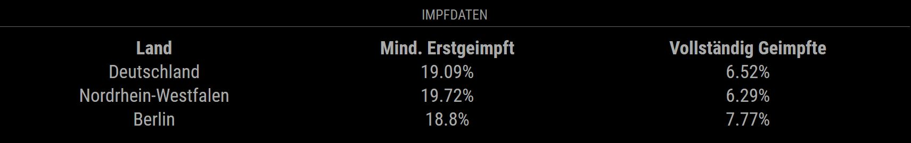

# MMM-Covid19-Vaccination
A [MagicMirror²](https://magicmirror.builders) module for Covid19 Vaccination Data for Germany

Using the data from "Berliner Morgenpost":


Using the data from "BMI, RKI":


## Dependencies
This module reads data from one of the following sources. The source can be configured in the config file. 

["Berliner Morgenpost"](https://www.morgenpost.de/), https://interaktiv.morgenpost.de/data/corona/rki-vaccinations.json<br>
["Impfdashboard.de, BMG, RKI"](https://impfdashboard.de/)

The API can be used without any registration.

The total population for each state for the relative calculation is taken from: [Statistisches Bundesamt](https://www.destatis.de/DE/Themen/Gesellschaft-Umwelt/Bevoelkerung/Bevoelkerungsstand/Tabellen/bevoelkerung-nichtdeutsch-laender.html) visited on 2021-02-01.
## Installation

Go to your MagicMirror's module folder:
cd ~/MagicMirror/modules

Clone this repository:
````
git clone https://github.com/fhinder/MMM-Covid19-Vaccination.git
````
Add the module to the modules list in  your config file:

````javascript
{
	module: "MMM-Covid19-Vaccination",
	position: "top_right",
	config:{
		reloadInterval: 60*60*1000,
		tableClass: "small",
    		percentage: true,
    		dataSource: "BMG"
		states: [		
			'Deutschland',
			'Berlin',
			'Baden-Württemberg',
     			'Nordrhein-Westfalen'
		]
	}
},
````
## Configuration

|option         | description|
|---------------|------------|
|reloadInterval | Reload Interval in ms <br> <b>Possible values</b>: <code>number</code> <br> <b>Default value</b>: 3600000 |
|tableClass	| Table configuration <br> <b>Default value</b>: "small" |
|dataSource | Switch to select the data source <br> <Possible values</b>: "Morgenpost" or "BMG" <br> <b>Devault value</b>: "BMG"|
|percentage| if true, vaccination progress is calculated in percentage of population. <br> <b>Possible values</b>: <code> true, false</code> <br> <b> Default value </b>: true |
|states	| Array of states in Germany to be displayed. If the array is empty, all states will be shown.  <br> <b>Possible values</b>: <code>array of string</code> <br> <b>Default value</b>: ["Deutschland", "Berlin", "Baden-Würtemberg", "Nordrhein-Westfalen"] |


## Outlook
If an official API for the vaccination in Germany is available, the source can be changed. Please create an issue, if a better API is known.
